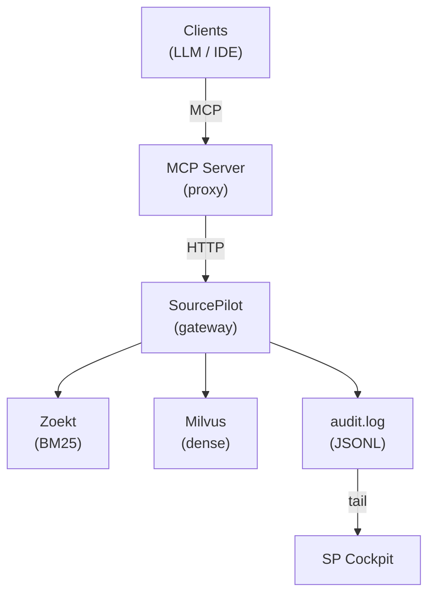

<div align="center">
  
  <h1>AOSP Code Search</h1>
  <p>Hybrid RAG code search over AOSP sources</p>
  <p>
    
    
    
  </p>
</div>

## Table of Contents
- [Architecture](#architecture)
- [Prerequisites](#prerequisites)
- [Quick Start](#quick-start)
- [Scripts Reference](#scripts-reference)
- [HTTP API](#http-api-sourcepilot-port-9000)
- [Layout](#layout)
- [Testing](#testing)
- [Environment](#environment)
- [Design Notes](#design-notes)

Packaged as three decoupled services:

| Service | Path | Port | Role |
|---|---|---|---|
| **SourcePilot** | `src/` | `9000` | Starlette HTTP API — query gateway, NL pipeline, Zoekt + dense adapters |
| **MCP Access Layer** | `mcp-server/` | stdio / `8888` | Thin MCP protocol proxy delegating to SourcePilot over HTTP |
| **SourcePilot Cockpit** | `sp-cockpit/` | `9100` | FastAPI + React SPA for browsing `audit.log` (read-only) |

The services share nothing but HTTP and the audit log. Each can be run, tested, and deployed independently.

## Architecture



**Request flow** (MCP path): tool call → `mcp-server/entry/handlers.py` → httpx → `src/app.py` → `gateway.search()` → classify → (Zoekt ‖ Dense) → RRF fusion → rerank → JSON.

## Prerequisites

| Dependency | Purpose | Check |
|---|---|---|
| Python 3 virtualenv | Runtime for SourcePilot, MCP, sp-cockpit | `/opt/pyenv/versions/dify_py3_env/bin/python3 --version` |
| Zoekt (`zoekt-webserver`) | BM25 code search backend | `zoekt-webserver -help` or Docker via `deploy/zoekt/` |
| Node.js + npm | Build sp-cockpit frontend (optional) | `node --version` |
| curl, jq, sqlite3 | Used by smoke test and helper scripts | `curl --version && jq --version && sqlite3 --version` |

Optional (for dense/semantic search): Milvus vector DB + embedding service. See `.env.example` for `DENSE_*` variables.

## Quick start

**1. Clone and configure environment**

```bash
cp .env.example .env
```

Edit `.env` — at minimum set:
- `ZOEKT_INDEX_PATH` — path to your local Zoekt index directory
- `NL_API_KEY` — API key for the NL rewrite model (if `NL_ENABLED=true`)

**2. Start all services**

```bash
scripts/run_all.sh
```

This launches (in order): zoekt-webserver → SourcePilot (port 9000) → MCP Server (port 8888) → sp-cockpit (port 9100). Press `Ctrl+C` to stop all.

**3. Verify**

```bash
curl http://localhost:9000/api/health          # SourcePilot health check
curl -X POST http://localhost:9000/api/search \
  -H "content-type: application/json" \
  -d '{"query":"binder_open","top_k":3}'       # test search
```

**Targeted launches** (start individual services):

```bash
scripts/run_sourcepilot.sh                                   # SourcePilot alone
scripts/run_mcp.sh                                           # MCP (auto-starts SourcePilot)
SOURCEPILOT_URL=http://localhost:9000 scripts/run_mcp.sh     # MCP against external SourcePilot
scripts/run_mcp.sh --transport streamable-http --port 8888   # MCP Streamable HTTP
scripts/run_sp_cockpit.sh                                  # sp-cockpit alone
```

## Scripts reference

> For detailed flags and environment variables, see [CLAUDE.md](CLAUDE.md).

| Category | Script | Purpose |
|---|---|---|
| **Runtime** | `run_all.sh` | One-command full stack (Zoekt + SourcePilot + MCP + sp-cockpit) |
| | `run_sourcepilot.sh` | Start SourcePilot HTTP API (port 9000) |
| | `run_mcp.sh` | Start MCP Server (stdio or Streamable HTTP) |
| | `run_sp_cockpit.sh` | Start sp-cockpit FastAPI + React SPA (port 9100) |
| | `_env.sh` | Shared `.env` loader, sourced by all `run_*.sh` scripts |
| **Indexing** | `reindex.sh` | Trigger Zoekt index rebuild via Docker |
| | `build_dense_index.py` | Build Milvus vector index from local source files |
| **Testing & Evaluation** | `smoke_queries.sh` | End-to-end smoke test with audit verification |
| | `test_dense.sh` | Verify dense search pipeline is triggered |
| | `eval_hybrid.py` | A/B comparison: hybrid (Zoekt+Dense) vs pure Zoekt |

## HTTP API (SourcePilot, port 9000)

| Method | Path | Purpose |
|---|---|---|
| GET  | `/api/health` | Liveness |
| POST | `/api/search` | Hybrid search (NL-aware) |
| POST | `/api/search_symbol` | Symbol search |
| POST | `/api/search_file` | File-name search |
| POST | `/api/search_regex` | Regex search |
| POST | `/api/list_repos` | List indexed repositories |
| POST | `/api/get_file_content` | Fetch full file from Zoekt |

## Layout

```
src/                           SourcePilot
├── app.py                     Starlette entry point
├── gateway/                   Query gateway (classify → route → fuse → rerank)
│   └── nl/                    NL pipeline (classifier, rewriter, cache)
├── adapters/                  Pluggable backends (Zoekt, Dense, Feishu stub)
├── observability/audit.py     Structured JSON audit log
└── config/                    Env-driven configuration

mcp-server/                    MCP Access Layer
├── mcp_server.py              Transport dispatcher
└── entry/                     handlers / stdio / http (with BearerTokenMiddleware)

sp-cockpit/                  FastAPI + React SPA (see sp-cockpit/README.md)

deploy/                        Merged Milvus + Neo4j + Zoekt + indexer compose
scripts/                       Orchestration, smoke tests, index build, A/B eval
tests/                         unit / integration / e2e
```

## Testing

```bash
# SourcePilot (unit + integration + e2e)
PYTHONPATH=src pytest tests/unit/sourcepilot/ tests/integration/ tests/e2e/ -v

# MCP
PYTHONPATH=mcp-server pytest tests/unit/mcp/ -v

# Everything
PYTHONPATH=src pytest tests/unit/sourcepilot/ tests/integration/ tests/e2e/ -v \
  && PYTHONPATH=mcp-server pytest tests/unit/mcp/ -v
```

Tests use `respx` to mock Zoekt — no live backend required.

For full testing documentation, see [docs/testing/README.md](docs/testing/README.md).

## Environment

| Variable | Default | Purpose |
|---|---|---|
| `ZOEKT_URL` | `http://localhost:6070` | Zoekt webserver |
| `ZOEKT_INDEX_PATH` | — | Local Zoekt index dir (native launch) |
| `SOURCEPILOT_URL` | `http://localhost:9000` | Used by MCP layer |
| `MCP_AUTH_TOKEN` | — | Bearer token for Streamable HTTP |
| `NL_ENABLED` / `NL_MODEL` | `true` / `CVTE-AUTO` | NL rewrite pipeline |
| `AUDIT_LOG_FILE` | `$PROJ_ROOT/audit.log` | SourcePilot writes here |
| `SP_COCKPIT_AUDIT_LOG_PATH` | `$PROJ_ROOT/audit.log` | sp-cockpit tails this |

Python runtime: `/opt/pyenv/versions/dify_py3_env/bin/python3`.

## Design notes

- **Two PYTHONPATH roots** (`src/`, `mcp-server/`) — no shared imports, only HTTP.
- **Zoekt score normalization** via sigmoid `1/(1+exp(-0.1*(score-10)))` inside `ZoektAdapter`.
- **Zoekt `/print`** returns HTML; `ZoektAdapter.fetch_file_content()` extracts `<pre>` and strips tags.
- **`X-Trace-Id`** propagates across services; audit events are JSONL with full `records[]` on pipeline stages.
- **Pluggable backends** via `SearchAdapter` ABC (`search`, `get_content`, `health_check`).
- **Non-blocking audit** via `QueueHandler` / `QueueListener`, started in the Starlette lifespan.
