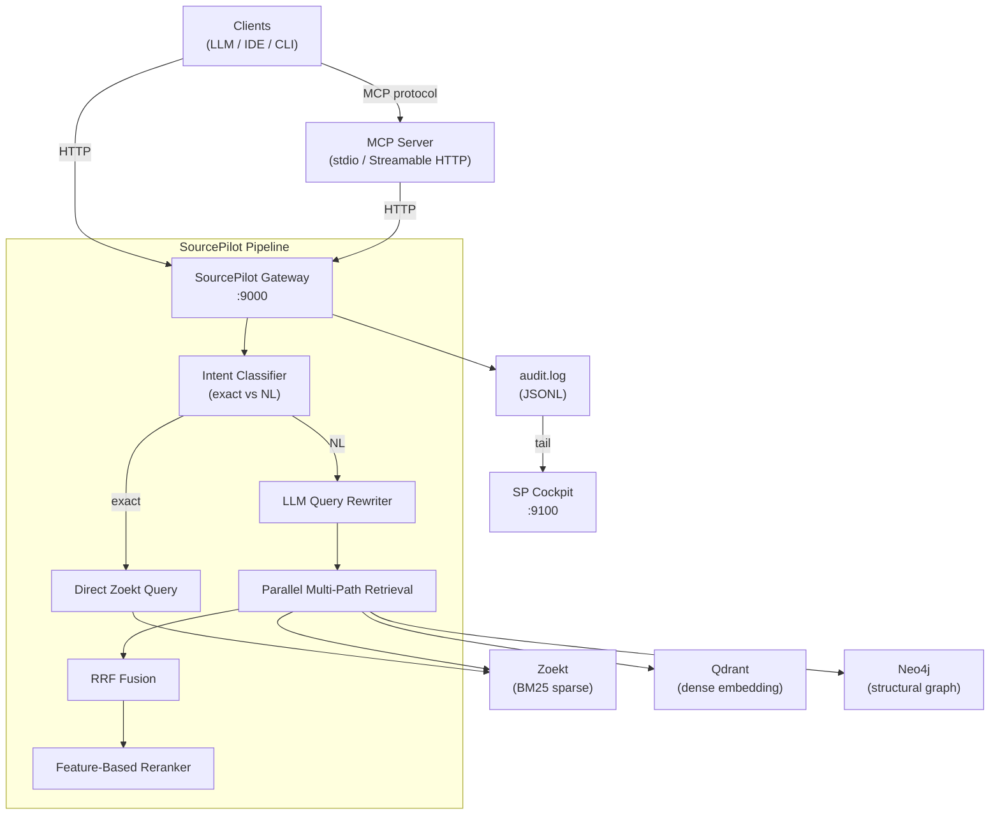

<div align="center">
  
  <p>A hybrid RAG code search system for large-scale codebases. Combines BM25 sparse retrieval (Zoekt), dense semantic search (Qdrant), and structural graph queries (Neo4j) with NL intent classification, LLM query rewriting, RRF fusion, and feature-based reranking — exposed via HTTP API and MCP protocol for seamless LLM/IDE integration.</p>
  <p>
    
    
    
  </p>
</div>

Packaged as three decoupled services:

| Service | Path | Port | Role |
|---|---|---|---|
| **SourcePilot** | `src/` | `9000` | Starlette HTTP API — query gateway, NL pipeline, Zoekt + dense adapters |
| **MCP Access Layer** | `mcp-server/` | stdio / `8888` | Thin MCP protocol proxy delegating to SourcePilot over HTTP |
| **SourcePilot Cockpit** | `sp-cockpit/` | `9100` | FastAPI + React SPA for browsing `audit.log` (read-only) |

The services share nothing but HTTP and the audit log. Each can be run, tested, and deployed independently.

## Architecture


```mermaid
flowchart TD
    Clients["Clients<br/>(LLM / IDE / CLI)"] -->|MCP protocol| MCP["MCP Server<br/>(stdio / Streamable HTTP)"]
    Clients -->|HTTP| SP
    MCP -->|HTTP| SP["SourcePilot Gateway<br/>:9000"]

    subgraph SourcePilot ["SourcePilot Pipeline"]
        SP --> Classifier["Intent Classifier<br/>(exact vs NL)"]
        Classifier -->|exact| Direct["Direct Zoekt Query"]
        Classifier -->|NL| Rewriter["LLM Query Rewriter"]
        Rewriter --> Parallel["Parallel Multi-Path Retrieval"]
        Parallel --> Fusion["RRF Fusion"]
        Fusion --> Ranker["Feature-Based Reranker"]
    end

    Direct --> Zoekt["Zoekt<br/>(BM25 sparse)"]
    Parallel --> Zoekt
    Parallel --> Qdrant["Qdrant<br/>(dense embedding)"]
    Parallel --> Neo4j["Neo4j<br/>(structural graph)"]

    SP --> Audit["audit.log<br/>(JSONL)"]
    Audit -->|tail| Cockpit["SP Cockpit<br/>:9100"]
```

**Request flow** (MCP path): tool call → `mcp-server/entry/handlers.py` → httpx → `src/app.py` → `gateway.search()` → classify intent → exact: direct Zoekt query; NL: LLM rewrite → parallel multi-path retrieval (Zoekt + Qdrant + Neo4j) → RRF fusion → feature-based rerank → JSON response.

**Key design decisions:**
- **Three retrieval paths** — BM25 (Zoekt) for lexical/exact matches, dense embeddings (Qdrant) for semantic similarity, structural graph (Neo4j) for call-hierarchy and dependency traversal.
- **Reciprocal Rank Fusion (RRF)** merges results from heterogeneous backends into a single ranked list without score calibration.
- **Zoekt score normalization** via sigmoid `1/(1+exp(-0.1*(score-10)))` before fusion.
- **Non-blocking audit** via `QueueHandler` / `QueueListener` in the Starlette lifespan — zero impact on search latency.
- **`X-Trace-Id`** propagates end-to-end across MCP → SourcePilot → backends for observability.

## Prerequisites

| Dependency | Purpose | Check |
|---|---|---|
| Python 3 virtualenv | Runtime for SourcePilot, MCP, sp-cockpit | `/opt/pyenv/versions/dify_py3_env/bin/python3 --version` |
| Zoekt (`sparse-index-zoekt`) | BM25 code search backend | `zoekt-webserver -help` or Docker via `deploy/sparse/zoekt/` |
| Node.js + npm | Build sp-cockpit frontend (optional) | `node --version` |
| curl, jq, sqlite3 | Used by smoke test and helper scripts | `curl --version && jq --version && sqlite3 --version` |

Optional (for dense/semantic search): Qdrant vector DB + embedding service. See `.env.example` for `DENSE_*` variables.

## Quick start

**1. Clone and configure environment**

```bash
cp .env.example .env
```

Edit `.env` — at minimum set:
- `ZOEKT_INDEX_PATH` — path to your local Zoekt index directory
- `NL_API_KEY` — API key for the NL rewrite model (if `NL_ENABLED=true`)
- `CODE_EMBEDDING_MODEL` — embedding model for dense search (default: `nomic-ai/CodeRankEmbed`)

**2. Configure projects**

Copy `config/projects.yaml.example` to `config/projects.yaml`, then declare each project you want to index. At minimum, make sure the project `name`, source paths, sparse index directory, and Zoekt URL are correct:

```yaml
projects:
  - name: myproject
    source_root: /path/to/aosp_project          # AOSP checkout root
    repo_path: /path/to/aosp_project/.repo      # path indexed by sparse reindex.sh

    sparse_index:
      index_dir: /path/to/aosp_project/.repo/.zoekt
      zoekt_url: http://localhost:6070

    dense_index:
      collection_name: aosp_code_myproject_dense
      embedding_model: nomic-ai/CodeRankEmbed   # must match CODE_EMBEDDING_MODEL
      include:
        - frameworks/base               # scope to specific sub-projects

    structural_index:
      include:
        - packages/modules/NetworkStack
```

When using the bundled Docker Compose Zoekt service, set `ZOEKT_INDEX_PATH` in `.env` to the same directory as `sparse_index.index_dir` for the project served on port 6070.

**3. Start infrastructure**

```bash
docker compose -f deploy/docker-compose.yml --env-file .env up -d
```

This starts Zoekt, Qdrant, Neo4j, and the embedding server.

**4. Build indexes**

```bash
# Sparse index (BM25) — uses config/projects.yaml
scripts/indexing/sparse/reindex.sh --project myproject
# or index every project declared in config/projects.yaml
scripts/indexing/sparse/reindex.sh --all

# Dense index (semantic embeddings) — vectorize source into Qdrant
scripts/indexing/dense/build_dense_index_batch.sh

# Structural index (call graph) — parse into Neo4j
scripts/indexing/structural/build_structural_index_batch.sh
```

> Each index type is independent — you can start with sparse only and add dense/structural later.
> Set `INDEXING_DRY_RUN=1` to preview sparse indexing without executing `zoekt-git-index`.

**5. Start application services**

```bash
scripts/run_all_dev.sh          # Dev mode: infra via Docker, apps as bare processes
# or
scripts/run_all.sh              # Full stack (all Docker)
```

This launches: Zoekt → SourcePilot (port 9000) → MCP Server (port 8888) → SP Cockpit (port 9100). Press `Ctrl+C` to stop all.

**6. Verify**

```bash
curl http://localhost:9000/api/health          # SourcePilot health check
curl -X POST http://localhost:9000/api/search \
  -H "content-type: application/json" \
  -d '{"query":"binder_open","project":"myproject","top_k":3}'
```

**Targeted launches** (start individual services):

```bash
scripts/run_sourcepilot.sh                                   # SourcePilot alone
scripts/run_mcp.sh                                           # MCP (auto-starts SourcePilot)
SOURCEPILOT_URL=http://localhost:9000 scripts/run_mcp.sh     # MCP against external SourcePilot
scripts/run_mcp.sh --transport streamable-http --port 8888   # MCP Streamable HTTP
scripts/run_sp_cockpit.sh                                    # SP Cockpit alone
```

## Contributing

Contributions are welcome! Feel free to open an issue for bug reports or feature requests, or submit a pull request directly.

Before submitting a PR, please make sure:
- Tests pass: `PYTHONPATH=src pytest tests/ -v`
- Linting is clean: `ruff check src/ mcp-server/ tests/`
- Shell scripts pass: `shellcheck -x -S error scripts/*.sh`

## License

MIT
