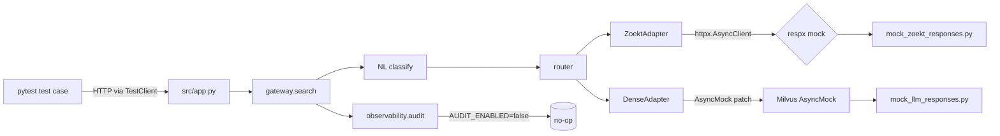
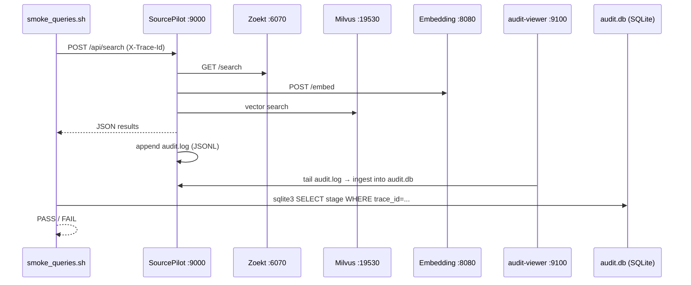

# Test Architecture

> Audience: **architect, new contributor**. Read this when you want to understand
> how the suites layer up, what each layer is responsible for, and how a request
> flows through the test fixtures.

## Test Pyramid

```
                          ┌────────────────────────────┐
                          │   Live Smoke Scripts       │   scripts/smoke_queries.sh
                          │   (real Zoekt + Milvus +   │   scripts/test_dense.sh
                          │    SourcePilot + LLM)      │   tests/test_mcp_endpoints.sh
                          └────────────────────────────┘
                       ┌──────────────────────────────────┐
                       │   E2E (in-process, mocked deps)  │   tests/e2e/
                       │   MCP layer ←→ SourcePilot       │   test_mcp_sourcepilot_chain.py
                       └──────────────────────────────────┘
                  ┌────────────────────────────────────────────┐
                  │   Integration (gateway pipeline + API)     │   tests/integration/
                  │   gateway → adapters (respx-mocked)        │   test_gateway_pipeline.py
                  │   HTTP API contract (Starlette TestClient) │   test_api_contract.py
                  └────────────────────────────────────────────┘
            ┌──────────────────────────────────────────────────────────┐
            │   Unit (per-module)                                      │   tests/unit/{sourcepilot,mcp}/
            │   adapters, gateway, NL pipeline, config, observability, │   audit-viewer/tests/
            │   MCP handlers/transports, audit-viewer ingester/api     │
            └──────────────────────────────────────────────────────────┘
```

The pyramid widens downward — most coverage is unit-level, with progressively
fewer (but more realistic) integration/e2e tests. The smoke scripts sit
**above** the pyramid because they are the only layer that exercises live
backends; they are not run by `pytest`.

## Where each test type lives

| Layer | Path | Run command | What it asserts |
|-------|------|-------------|-----------------|
| Unit (SourcePilot) | `tests/unit/sourcepilot/{adapters,config,gateway,gateway/nl,observability}/` | `PYTHONPATH=src pytest tests/unit/sourcepilot/ -v` | One module at a time, with everything else mocked |
| Unit (MCP) | `tests/unit/mcp/`, `tests/unit/mcp/entry/` | `PYTHONPATH=mcp-server pytest tests/unit/mcp/ -v` | MCP handlers, stdio transport, HTTP transport |
| Unit (Audit Viewer) | `audit-viewer/tests/` | `(cd audit-viewer && pytest -v)` | Parser, ingester, API, retention |
| Integration | `tests/integration/{test_gateway_pipeline.py, test_api_contract.py}` | `PYTHONPATH=src pytest tests/integration/ -v` | Full gateway pipeline (classify → search → fuse → rank) with respx-mocked Zoekt; HTTP API shape via Starlette TestClient |
| E2E | `tests/e2e/test_mcp_sourcepilot_chain.py` | `PYTHONPATH=src pytest tests/e2e/ -v` | MCP server in-process calls SourcePilot in-process (both Python imports; HTTP client is `respx`-mocked) |
| Live smoke | `scripts/smoke_queries.sh`, `scripts/test_dense.sh`, `tests/test_mcp_endpoints.sh` | see [smoke-scripts.md](./smoke-scripts.md) | Full real stack: Zoekt + Milvus + Embedding + SourcePilot + audit-viewer |

## Service / PYTHONPATH boundary

The repo intentionally splits two Python projects in the same workspace:

```
repo root
├── src/                  ← PYTHONPATH=src    (SourcePilot)
│   ├── app.py
│   ├── gateway/
│   ├── adapters/
│   └── observability/
├── mcp-server/           ← PYTHONPATH=mcp-server  (MCP)
│   ├── mcp_server.py
│   └── entry/
├── audit-viewer/         ← own pyproject.toml + own tests/
│   ├── audit_viewer/
│   └── tests/
└── tests/                ← shared pytest tree
    ├── conftest.py       ← global env vars + shared mock fixtures
    ├── unit/sourcepilot/  → conftest.py adds PYTHONPATH=src
    ├── unit/mcp/          → conftest.py adds PYTHONPATH=mcp-server
    ├── integration/       → conftest.py adds PYTHONPATH=src
    └── e2e/               → conftest.py adds BOTH src and mcp-server
```

This is why the canonical run commands in `CLAUDE.md` always include
`PYTHONPATH=`. The two test trees can be invoked independently or together —
each conftest is responsible for its own `sys.path` manipulation.

## Request flow under test (mocked path)



In the integration suite, `respx` intercepts all outgoing httpx calls and
returns canned data from `tests/fixtures/mock_*_responses.py`. The dense
adapter's Milvus client is replaced via `unittest.mock.AsyncMock`. Audit
emission is disabled globally via `AUDIT_ENABLED=false` in
`tests/conftest.py`.

## Request flow end-to-end (live smoke)



The smoke script generates a `trace_id`, fires the request, then polls
`audit-viewer/data/audit.db` to verify the expected pipeline stages
(`classify`, `rewrite`, `dense_search`, `rrf_merge`, `rerank`) appeared with
the right `records_count`. Exit code reflects both HTTP outcome and audit
verification.

## Why two PYTHONPATHs (and why this matters for tests)

The MCP layer is a **thin protocol proxy** that forwards to SourcePilot over
HTTP. The two projects do not share imports, which means:

- SourcePilot unit tests cannot accidentally import MCP code (and vice versa).
- The `tests/e2e/` tree must `sys.path.insert` both roots (see
  `tests/e2e/conftest.py`) — this is the only place where both layers run in
  the same Python process for testing.
- A change to MCP cannot break SourcePilot tests, and vice versa, unless it
  changes the HTTP contract (`tests/integration/test_api_contract.py`
  guards that contract).

## See also

- [pytest-suite.md](./pytest-suite.md) — file-by-file inventory & run commands
- [fixtures.md](./fixtures.md) — how the mocks are wired
- [smoke-scripts.md](./smoke-scripts.md) — live-stack diagrams in detail
