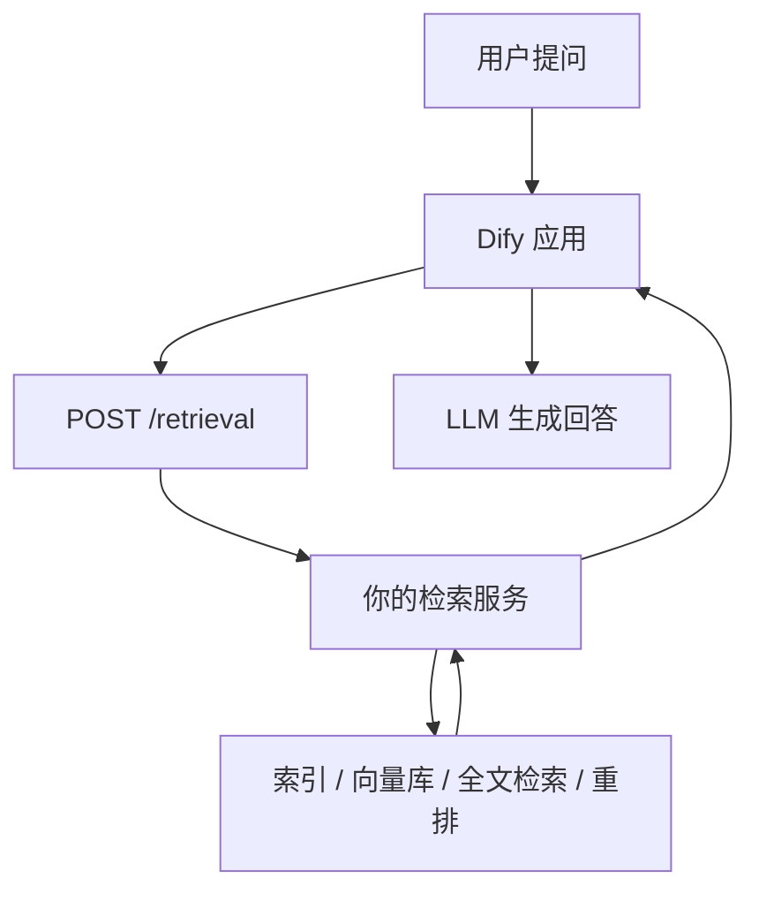
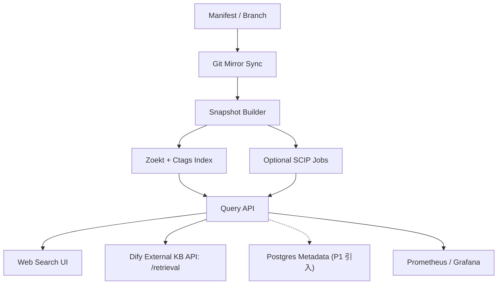

# AOSP 多 Git 仓库代码检索与 Dify 外部知识库方案总结

- 日期：2026-03-18
- 主题：Dify 外部知识库、代码检索技术趋势、AOSP 多仓库代码搜索选型与落地方案

## 概述

这份文档总结了前面的调研和分析，目标是回答三个问题：

1. Dify 如何连接外部知识库，以及自建外部知识库需要满足什么接口要求。
2. 当前代码检索和 RAG 检索底座的主流技术方向是什么。
3. 如果目标是 AOSP 这种由 `repo` 管理的多 Git 仓库代码树，应该采用什么样的检索架构。

核心结论是：

- Dify 的外部知识库本质上是一个标准化检索接口，而不是托管知识内容。
- 当前主流方向不是“纯向量检索”，而是“全文检索 + 稠密向量 + 稀疏检索 + 融合 + 重排”的多阶段检索。
- 对 AOSP 这类代码库，主检索应该优先选代码搜索引擎，而不是向量库。
- 在自建开源方案里，`Zoekt + manifest 感知控制层 + Dify /retrieval 适配层` 是性价比最高的一条路。

---

## 1. Dify 外部知识库的工作方式

Dify 连接外部知识库时，并不会把外部内容搬进 Dify，而是在运行时调用你提供的检索 API。

处理流程如下：



这意味着 Dify 负责的是：

- 保存外部知识库连接配置
- 在应用运行时发起检索
- 把召回结果作为上下文提供给模型

这也意味着 Dify 不负责：

- 文档切分
- Embedding
- 索引构建和更新
- 检索策略优化

---

## 2. Dify 外部知识库 API 契约

官方规范要求外部服务暴露如下接口：

```text
POST <your-endpoint>/retrieval
Authorization: Bearer {API_KEY}
Content-Type: application/json
```

请求体核心字段如下：

```json
{
  "knowledge_id": "your-knowledge-id",
  "query": "你的问题",
  "retrieval_setting": {
    "top_k": 5,
    "score_threshold": 0.5
  },
  "metadata_condition": {
    "logical_operator": "and",
    "conditions": []
  }
}
```

响应体核心字段如下：

```json
{
  "records": [
    {
      "title": "document title",
      "content": "matched chunk",
      "score": 0.91,
      "metadata": {
        "path": "/docs/a.md"
      }
    }
  ]
}
```

设计要点：

- `knowledge_id` 应映射到你外部系统中的知识库、索引、collection、pipeline 或搜索上下文。
- `top_k` 和 `score_threshold` 应尽量在你的检索服务里执行，而不是只在 Dify 侧做裁剪。
- `metadata_condition` 适合承载 repo、路径前缀、语言、标签、日期等过滤条件。
- 如果你想把接入做成 Dify 插件，也仍然要对外暴露一个符合该契约的 `/retrieval`。

---

## 3. 检索技术方向总结

### 3.1 总体趋势

当前主流方向已经不是“单一向量检索”，而是多阶段检索：

- 第一阶段：全文检索 / 符号检索 / 稠密向量 / 稀疏语义检索并行召回
- 第二阶段：融合排序，例如 `RRF`
- 第三阶段：可选重排，例如 `cross-encoder rerank`

### 3.2 全文检索仍然是主力

对代码、SKU、路径、人名、专有名词这类强精确匹配场景，`BM25`、短语查询、路径过滤、字段加权仍然非常关键。  
对代码搜索来说，这一层的重要性通常高于向量检索。

### 3.3 Hybrid 已经成为默认路线

主流搜索系统都在推荐全文和语义检索并行，再做融合，而不是二选一。

常见组合：

- `BM25 + dense embedding`
- `BM25 + sparse semantic + dense semantic`
- `symbol search + path filter + regex + rerank`

### 3.4 稀疏语义检索在上升

除了传统 BM25，还出现了 learned sparse retrieval，例如 `SPLADE`、`BGE-M3 sparse`。  
这类方案兼顾倒排索引效率和一定的语义扩展能力。

> **注意：** 当前主流 learned sparse retrieval 模型基本都是在自然语言语料上训练的，对代码 token（符号名、路径、宏、缩写）的效果尚未被充分验证。在代码检索场景中，BM25 仍然是更可靠的稀疏检索基线，learned sparse 可以作为探索方向但不宜直接替代。

### 3.5 多向量和 Late Interaction 在增强复杂检索

单向量无法很好表示长文档和细粒度匹配，于是出现了：

- `ColBERT`
- `Jina-ColBERT`
- `ColPali`
- Qdrant / Milvus 的 multivector 能力

这类方案更适合长文档、多模态文档和复杂语义匹配，但成本也更高。

### 3.6 Rerank 仍然是效果上限

生产上最常见、最稳的精排方案仍然是 `cross-encoder rerank`。  
它适合对第一阶段召回出来的较小候选集做精排，而不适合作为主召回。

### 3.7 基础设施层越来越强调成本与可扩展性

向量索引层的主流方向包括：

- 量化
- SSD/DiskANN 类索引
- 更强的 metadata filter
- 增量更新
- 大规模 shard 管理

更详细的技术分析、职责拆分和按场景选型建议，见单独文档：

- [2026-03-18-retrieval-tech-landscape-vector-fulltext-rerank.md](/Users/yukun/Dify/docs/2026-03-18-retrieval-tech-landscape-vector-fulltext-rerank.md)

---

## 4. 为什么 AOSP 是一个特殊场景

AOSP 的难点不只是代码量大，而是：

- 它是由很多 Git 仓库拼出来的一棵逻辑代码树
- 开发者实际看到的是 manifest 展开后的路径视图，而不是单仓库视图
- 查询需求以符号、路径、类名、函数名、宏、正则、跨 repo 上下文为主
- 同时还存在多语言、多分支、多 release、多子树的问题

这意味着：

- 代码检索的主引擎应该优先考虑全文、正则、路径、符号能力
- 多 repo 的逻辑组织必须体现在索引命名和查询上下文中
- 向量库不能作为主检索方案，只能做辅助手段

---

## 5. AOSP 多仓库代码检索方案对比

### 5.1 Zoekt

优点：

- 非常适合大规模多 repo 代码全文检索
- 支持子串、正则、布尔查询
- 能配合 `ctags` 做符号相关排序
- 部署和控制成本相对低
- 很适合做第一阶段主召回

不足：

- 精确“定义/引用”导航能力不如基于编译索引的方案
- 需要自己补 manifest 语义、权限、上下文和二次排序
- AOSP 源码 40GB+，Zoekt 全量建索引对内存和磁盘的需求不小，P0 阶段需要提前做资源预估（预计需要数十 GB 内存和上百 GB 磁盘，索引构建时间在小时级别）
- Zoekt 目前由 Sourcegraph 维护，如果 Sourcegraph 未来调整开源策略或减少投入，需要有 fork / 自维护的预案

结论：

- 自建开源方案首选

### 5.2 Sourcegraph

优点：

- 多 repo 搜索体验成熟
- 支持精确代码导航
- 基于 `SCIP`，可以做跨仓库定义/引用跳转

不足：

- 成本更高
- 需要为不同语言生成和上传精确索引
- 对复杂构建体系的接入成本较大

结论：

- 如果预算充足且非常重视精确导航，是最完整的成品路线

### 5.3 OpenGrok

优点：

- 经典、稳定
- 强调源码浏览和 cross reference
- 支持多种文件格式和 SCM 历史

不足：

- 现代代码搜索体验和扩展性不如前两者
- 不是我对 AOSP 场景的第一推荐

结论：

- 可用，但更适合传统源码浏览门户

### 5.4 Livegrep / Hound

**Livegrep** 是 Google 工程师开发的基于 trigram 索引的代码搜索引擎，适用于 Linux kernel 等大型代码库。**Hound** 是 Etsy 出品的类似方案。

优点：

- 搜索速度极快
- 部署简单

不足：

- 功能集不如 Zoekt 丰富（缺乏 ctags 集成、分支管理、布尔查询等能力）
- 对多 repo、多分支的管理和组织能力较弱
- 社区活跃度和生态不如 Zoekt

结论：

- 对 AOSP 这种多 repo + 多分支 + 需要 manifest 感知的场景，Zoekt 更适合；Livegrep / Hound 更适合单仓或少量仓库的快速搜索

### 5.5 向量库

优点：

- 适合自然语言问法
- 适合做“解释型”检索和 RAG 辅助

不足：

- 对符号、路径、宏、类名、精确匹配明显不如代码搜索引擎
- 作为主检索会引入很多误召回

结论：

- 不适合做 AOSP 代码搜索主引擎

---

## 6. 推荐落地架构

推荐架构：

- 主检索：`Zoekt + Universal Ctags`
- 仓库组织：`repo manifest` 感知控制层
- 查询服务：自定义 Query API
- 外部知识库接入：Dify `/retrieval`
- 二期精确导航：按热点模块补 `SCIP`

### 6.1 架构图



### 6.2 关键设计点

1. `knowledge_id` 设计

- 一个 `knowledge_id` 对应一个 manifest 快照或一个搜索上下文
- 例子：`aosp:android-14.0.0_r1`（使用真实 AOSP 分支名）
- 例子：`aosp:android15-release:frameworks/base`
- 也可以定义自定义别名如 `aosp:latest`，但内部应映射到真实分支名

2. 仓库命名

- 索引里的 repo 名不要只用 Git 仓库名
- 应直接使用 manifest path，例如 `frameworks/base`、`system/core`
- 这样结果路径才符合开发者在 AOSP checkout 中的认知

3. branch / release 隔离

- 每个 release 或 branch 应独立为一个 snapshot
- 不建议把多个分支混在一个索引空间

4. 查询意图分流

- 符号名、类名、函数名：走 exact/symbol 优先
- 文件路径、`Android.bp`、宏名：走 path/filter/regex
- 自然语言问题：先改写 query，再查 Zoekt

5. 代码片段上下文窗口策略

- 返回结果不要只给单行命中
- 应返回带上下文的代码片段
- Zoekt 返回的是行级命中结果，需要在 Query API 层决定上下文窗口策略：
  - 基础策略：命中行 ±15~30 行
  - 进阶策略：利用 ctags 信息扩展到完整函数/类级别
  - 长函数截断：如果函数体超过 token 上限，截取命中行附近上下文
- 上下文窗口大小直接影响 RAG 质量，建议可配置并通过实验调优
- `metadata` 中建议携带 `repo`、`branch`、`path`、`start_line`、`end_line`、`symbol`

---

## 7. 推荐实施阶段

### P0：最小可用版

- 只支持一个 release，例如 `android-latest-release`
- 打通 mirror、snapshot、Zoekt、Web UI、Dify `/retrieval`
- 支持 repo/path/language 基础过滤

### P1：工程化增强

- 支持多 branch / 多 release
- 支持增量更新
- 引入 Postgres 存储 snapshot 和 manifest 元数据
- 增加权限、缓存、观测和告警

### P2：热点模块精确导航

- 给 `frameworks/base`、`system/core`、`packages/modules/*` 这类热点模块补 `SCIP`
- 优先接入 `scip-clang`、`scip-java`
- 只在需要 compiler-accurate 导航的地方启用

> **风险提示：** `scip-clang` 依赖编译命令数据库（`compile_commands.json`）。AOSP 使用 Soong/Blueprint 构建系统，不是标准 CMake/Makefile，从 Soong 生成 `compile_commands.json` 本身是一个非平凡的工程问题（需要配合 `soong_ui` 的 `--compile-commands` 或自行从 Ninja 文件提取）。这是 P2 的主要前置依赖和技术风险，需提前验证可行性。

### P3：自然语言增强

- 为自然语言查询加 query rewrite
- 对 top N 候选做轻量 rerank
- 增加“代码片段摘要”和“模块级聚合说明”

> **难点提示：** 代码场景的 query rewrite 比文档场景难度大很多。例如用户问"SystemServer 启动流程"，rewrite 需要展开为 `SystemServer`、`startSystemServer`、`SystemServiceManager`、`startBootstrapServices` 等多个相关符号。这要求 rewrite 模块具备一定的代码领域知识，可能需要借助 LLM 做 query expansion，或维护一个高频符号/概念的映射表。

---

## 8. 最终建议

如果目标是做一套可维护、可落地、能接 Dify 的 AOSP 代码检索系统，推荐路线是：

**先做 manifest-aware 的 Zoekt 搜索平台，再把它包装成 Dify 外部知识库 API；精确代码导航放到二期，对热点模块补 SCIP。**

这是当前在成本、效果、复杂度和可维护性之间最平衡的方案。

不推荐一开始做的事情：

- 不要用向量库做主检索
- 不要一开始对全量 AOSP 做精确编译索引
- 不要把所有 branch 混在同一个检索上下文里

---

## 参考资料

- [Dify 连接外部知识库](https://docs.dify.ai/zh/use-dify/knowledge/connect-external-knowledge-base)
- [Dify 外部知识库 API](https://docs.dify.ai/zh/use-dify/knowledge/external-knowledge-api)
- [Dify 插件与端点能力](https://docs.dify.ai/zh/develop-plugin/dev-guides-and-walkthroughs/endpoint)
- [Zoekt](https://github.com/sourcegraph/zoekt)
- [Sourcegraph Code Search](https://sourcegraph.com/docs/code-search)
- [Sourcegraph Precise Code Navigation](https://sourcegraph.com/docs/code-search/code-navigation/precise_code_navigation)
- [SCIP](https://github.com/sourcegraph/scip)
- [OpenGrok](https://oracle.github.io/opengrok/)
- [Android Code Search / AOSP 文档](https://source.android.com/docs/setup/contribute/code-search)
- [Livegrep](https://github.com/livegrep/livegrep)
- [Hound](https://github.com/hound-search/hound)
- [Elastic Hybrid Search](https://www.elastic.co/docs/solutions/search/hybrid-semantic-text)
- [Azure AI Search Hybrid Search](https://learn.microsoft.com/en-us/azure/search/hybrid-search-overview)
- [OpenSearch Semantic and Hybrid Search](https://docs.opensearch.org/latest/tutorials/vector-search/neural-search-tutorial/)
- [Qdrant Vectors / Hybrid Queries](https://qdrant.tech/documentation/concepts/vectors/)
- [Milvus Multi-Vector Search](https://milvus.io/docs/multi-vector-search.md)
- [Cohere Rerank](https://docs.cohere.com/v2/docs/rerank)
- [Voyage Reranker](https://docs.voyageai.com/docs/reranker)
- [ColBERT](https://arxiv.org/abs/2004.12832)
- [SPLADE v2](https://arxiv.org/abs/2109.10086)
