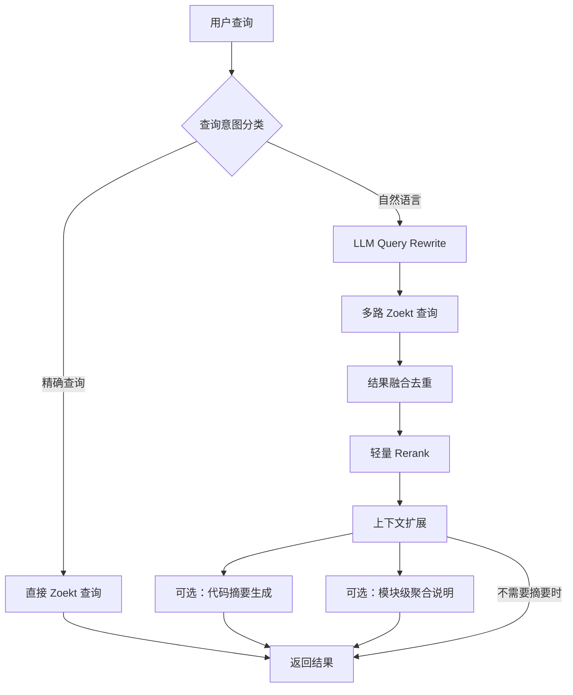

# P3：自然语言增强 — 详细实施方案

- 日期：2026-03-19
- 前置依赖：P0（Zoekt + Ctags + Dify `/retrieval`）和 P1（多 branch、增量更新、元数据管理）已完成
- 说明：**P3 不依赖 P2（SCIP 精确导航）**，可以在跳过 P2 的情况下单独实施
- 目标：让 AOSP 代码搜索系统能够接受自然语言问题，返回语义相关的代码片段

## 概述

P3 要解决的核心问题是：**Zoekt 擅长精确文本匹配，但面对自然语言问题（如"SystemServer 的启动流程"）无法有效召回相关代码**。

P3 不是要替换 Zoekt，而是在 Zoekt 之上增加一个"自然语言理解层"，让系统能处理两类查询：

1. **精确查询**（符号名、路径、正则）→ 直接走 Zoekt，不经过 NL 层
2. **自然语言查询**（描述性问题）→ 经过 query rewrite → 多路 Zoekt 查询 → 融合 → rerank → 返回结果

核心结论：**不需要引入向量数据库**。用 LLM 做 query rewrite + Zoekt 多路召回 + 轻量 rerank，就是当前性价比最高的路线。

一句话总结 P3 的实现思路：

`自然语言识别 -> query rewrite -> 多路 Zoekt 召回 -> 轻量 rerank -> 上下文扩展 -> 可选摘要/模块聚合`

---

## 1. 整体架构



关键设计决策：

- **不引入向量数据库**：Zoekt 已经能做主召回，自然语言层只需要把 NL 问题翻译成 Zoekt 能理解的查询
- **LLM 调用控制在 1-2 次**：query rewrite 一次，可选 summary 一次
- **第一版优先 feature-based rerank**：先不引入很重的排序模型
- **rerank 可逐步升级**：效果不够时，再补本地 cross-encoder

### 1.1 为什么 P3 可以先于 P2

P2 解决的是 compiler-accurate 的“定义/引用/实现”导航问题，P3 解决的是“自然语言问题如何转成可检索代码信号”的问题。这两者关注点不同：

- P2 更偏静态分析和代码图谱
- P3 更偏查询理解和检索编排

因此，在已有 `Zoekt + Ctags + Query API` 的前提下，P3 完全可以先落地。  
P3 的核心价值来自：

- 把自然语言问题翻译成代码搜索能理解的 query
- 用多路召回提高 hit rate
- 用轻量重排和摘要提升最终可读性

这些能力都不要求先有 `SCIP`。

---

## 2. 查询意图分类

在 Query API 层增加一个轻量分类器，判断用户输入是精确查询还是自然语言查询。

### 2.1 规则优先策略（推荐先用这个）

不需要 LLM，用规则即可覆盖大多数情况：

```python
def classify_query(query: str) -> str:
    """返回 'exact' 或 'natural_language'"""
    
    # 包含代码特征 → 精确查询
    if re.search(r'[A-Z][a-z]+[A-Z]', query):  # CamelCase
        return 'exact'
    if re.search(r'[a-z]+_[a-z]+', query):  # snake_case
        return 'exact'
    if '/' in query or '.' in query:  # 路径或文件名
        return 'exact'
    if re.search(r'^r".*"$', query):  # 正则表达式
        return 'exact'
    if query.startswith('sym:') or query.startswith('file:'):  # Zoekt 修饰符
        return 'exact'
    
    # 包含自然语言特征 → 自然语言
    nl_indicators = ['怎么', '什么', '如何', '为什么', '哪里', '流程',
                     'how', 'what', 'why', 'where', 'explain', 'find']
    if any(ind in query.lower() for ind in nl_indicators):
        return 'natural_language'
    
    # 默认：如果 query 比较长且没有代码特征，倾向 NL
    if len(query) > 20 and ' ' in query:
        return 'natural_language'
    
    return 'exact'
```

### 2.2 为什么不用 LLM 做分类

- 增加一次 LLM 调用 = 增加 200-500ms 延迟
- 规则分类准确率已经足够高（>90%）
- 误分类的代价不大：NL 查询走 exact 只是结果不够好，不会出错

> 工程建议：分类器一定要保守。宁可把一部分自然语言问题判成 exact，也不要把明显的 symbol/path 查询误判成 natural language，否则会把本来很准的精确检索搞坏。

---

## 3. LLM Query Rewrite（核心模块）

这是 P3 最关键的模块。目标是把自然语言问题转换成多个 Zoekt 查询。

### 3.1 Rewrite 策略

采用 **multi-query expansion** 策略：一次 LLM 调用生成多个不同角度的搜索查询。

**输入**：用户的自然语言问题
**输出**：3-5 个 Zoekt 查询（符号名、关键类名、关键函数名、文件路径模式等）

### 3.2 Prompt 设计

```text
你是一个 AOSP（Android Open Source Project）代码搜索助手。
用户会用自然语言描述他们想找的代码。你的任务是把用户问题转换成多个代码搜索查询。

规则：
1. 生成 3-5 个搜索查询，每个查询应该从不同角度切入
2. 查询应包含：相关的类名、函数名、关键变量名、文件路径模式
3. 使用 Zoekt 查询语法（支持：sym:符号名  file:路径  lang:语言  case:yes）
4. 优先使用 Android/AOSP 常见命名惯例（如 CamelCase 类名、Android 包路径）
5. 不要猜测不确定的符号名，宁可用关键词组合

输出格式（严格 JSON）：
{
  "intent": "用一句话总结用户想找什么",
  "queries": [
    {"query": "搜索查询1", "rationale": "为什么这样查"},
    {"query": "搜索查询2", "rationale": "为什么这样查"}
  ],
  "expected_languages": ["java", "cpp"],
  "path_hints": ["frameworks/base", "system/core"]
}

用户问题：{user_query}
```

### 3.3 示例

**输入**：`SystemServer 的启动流程`

**LLM 输出**：
```json
{
  "intent": "理解 Android SystemServer 进程的启动和初始化流程",
  "queries": [
    {"query": "sym:startSystemServer", "rationale": "SystemServer 启动入口函数"},
    {"query": "sym:SystemServer.main OR sym:SystemServer.run", "rationale": "SystemServer 主方法"},
    {"query": "sym:startBootstrapServices OR sym:startCoreServices", "rationale": "SystemServer 内部服务启动方法"},
    {"query": "file:SystemServer.java", "rationale": "SystemServer 主文件"},
    {"query": "sym:ZygoteInit.forkSystemServer", "rationale": "从 Zygote fork SystemServer 的流程"}
  ],
  "expected_languages": ["java"],
  "path_hints": ["frameworks/base/services"]
}
```

### 3.4 LLM 选型建议

| 模型 | 延迟 | 成本 | 适用场景 |
|---|---|---|---|
| `gpt-4o-mini` / `claude-3-5-haiku` | 200-400ms | 低 | 推荐默认选择 |
| `deepseek-chat` | 300-500ms | 极低 | 预算敏感时的备选 |
| 本地 `Qwen2.5-7B-Instruct` | 100-300ms | 仅 GPU 成本 | 完全自部署场景 |

**推荐**：先用 `gpt-4o-mini` 或 `claude-3-5-haiku` 验证效果，效果稳定后如需降本再迁移到本地模型。

### 3.5 缓存策略

Query rewrite 的结果应积极缓存：

- **热门查询缓存**：维护一个 LRU 缓存（按 query 文本 hash），TTL 24h
- **符号映射表**：将高频的自然语言概念映射到符号预先建表

```python
# 高频映射表示例（可人工维护 + LLM 辅助扩展）
CONCEPT_TO_SYMBOLS = {
    "系统服务启动": ["SystemServer", "startBootstrapServices", "startCoreServices"],
    "Activity 生命周期": ["ActivityThread", "handleLaunchActivity", "performCreate"],
    "Binder 通信": ["BinderProxy", "transact", "onTransact", "IPCThreadState"],
    "权限检查": ["checkPermission", "enforcePermission", "PermissionManagerService"],
    "窗口管理": ["WindowManagerService", "WindowState", "DisplayContent"],
}
```

映射表命中时可以直接跳过 LLM 调用，进一步降低延迟和成本。

### 3.6 第一版 rewrite 的边界

第一版 rewrite 不追求“理解全部代码语义”，只追求把自然语言问题翻译成更像代码搜索 query 的结构化信号：

- `symbols`：可能相关的类名、函数名、宏名
- `paths`：可能相关的目录或文件
- `repos`：可能相关的 repo 或模块
- `keywords`：适合全文检索的关键词
- `variants`：几种改写后的查询

如果系统能稳定把“SystemServer 启动流程”翻译成 `SystemServer`、`startBootstrapServices`、`frameworks/base` 这一类信号，P3 的第一阶段目标就已经达成。

---

## 4. 多路召回与融合

### 4.1 多路 Zoekt 查询

将 LLM 生成的多个查询并行发送给 Zoekt：

```python
async def multi_query_zoekt(queries: list[dict], knowledge_id: str) -> list:
    """并行执行多个 Zoekt 查询，合并结果"""
    tasks = []
    for q in queries:
        tasks.append(zoekt_search(
            query=q["query"],
            repos=resolve_repos(knowledge_id),
            max_results=20  # 每路召回 top 20
        ))
    
    results = await asyncio.gather(*tasks)
    return merge_and_dedup(results)
```

### 4.2 结果融合策略

来自不同查询的结果需要融合去重：

1. **去重**：按 `(repo, path, start_line, end_line)` 去重
2. **RRF 融合**：对在多路查询中都出现的结果给予更高权重

```python
def rrf_merge(result_lists: list[list], k=60) -> list:
    """Reciprocal Rank Fusion"""
    scores = defaultdict(float)
    docs = {}
    
    for result_list in result_lists:
        for rank, doc in enumerate(result_list):
            doc_id = (doc.repo, doc.path, doc.start_line)
            scores[doc_id] += 1.0 / (k + rank + 1)
            docs[doc_id] = doc
    
    sorted_ids = sorted(scores.keys(), key=lambda x: scores[x], reverse=True)
    return [docs[doc_id] for doc_id in sorted_ids]
```

### 4.3 融合后候选集大小

- 每路召回 top 20（3-5 路 = 60-100 条原始结果）
- 去重后通常剩 30-60 条
- 取 RRF 排序后 top 25 送入 rerank

### 4.4 多路召回的最小推荐配置

如果要先做一个可上线的最小版本，建议固定 4 路：

1. `symbol-like query`
2. `path/file query`
3. `keyword/BM25 query`
4. `repo/path constrained query`

必要时再加一条“宽松兜底 query”。  
不要第一版就做太多查询路数，否则很容易把结果噪声和延迟都拉高。

---

## 5. Rerank

### 5.1 为什么需要 Rerank

Zoekt 的排序基于文本匹配（TF-IDF 相似的信号），不理解语义。RRF 融合也只是基于排名位置。
需要一个理解"用户问题和代码片段语义相关性"的模型来做最终排序。

### 5.1.1 第一版为什么建议先做轻量 Rerank

在 P3 第一版里，推荐先上 feature-based rerank，而不是立刻引入较重的模型。  
推荐特征包括：

- 命中是否落在 symbol 上
- 文件名或路径是否被 query 提到
- 命中密度
- 是否落在高优先级 repo
- 是否被多条 rewrite query 同时命中

这样做的好处是：

- 延迟更低
- 调试更容易
- 可以先验证 query rewrite 和多路召回是否已经足够提升效果

如果 feature-based rerank 不够，再升级到本地 `cross-encoder rerank`。

### 5.2 推荐方案

**自部署 cross-encoder**，推荐 `bge-reranker-v2-m3`：

- 支持中英文
- 模型不大（约 568M 参数），单 GPU 即可部署
- 对 top 25 重排延迟约 50-150ms（批量推理）

部署方式：

```bash
# 用 FastAPI + sentence-transformers 部署
pip install sentence-transformers fastapi uvicorn

# 或用 TEI（Text Embeddings Inference）
docker run -p 8082:80 \
  ghcr.io/huggingface/text-embeddings-inference:latest \
  --model-id BAAI/bge-reranker-v2-m3 \
  --port 80
```

### 5.3 Rerank 的输入格式

```python
def rerank(query: str, candidates: list[dict], top_n: int = 10) -> list[dict]:
    """
    query: 用户原始自然语言问题
    candidates: Zoekt 返回的代码片段列表
    top_n: 最终返回条数
    """
    pairs = []
    for c in candidates:
        # 构造 query-document pair
        doc_text = f"[{c['path']}]\n{c['content']}"
        pairs.append((query, doc_text))
    
    scores = reranker.compute_score(pairs)
    
    ranked = sorted(zip(candidates, scores), key=lambda x: x[1], reverse=True)
    return [c for c, s in ranked[:top_n]]
```

### 5.4 不使用 Rerank API 的原因

Cohere Rerank / Voyage Reranker 虽然效果好，但：

- 每次查询都有网络延迟（200-500ms）
- 有 API 成本
- 代码片段可能含敏感信息，不适合发到外部 API

自部署 `bge-reranker-v2-m3` 是更好的选择。

---

## 6. 可选：代码摘要生成

在返回搜索结果给 Dify 时，可以为 top N 结果生成自然语言摘要，帮助 LLM 更好地理解代码上下文。

### 6.1 什么时候需要

- 来自 Dify 的 RAG 查询：**推荐生成摘要**（帮助主模型理解代码）
- 来自 Web Search UI 的查询：**不需要**（开发者直接看代码）

可以通过 Dify 请求中的 metadata 或来源标识来区分。

### 6.2 摘要策略

对 rerank 后的 top 3-5 结果，用轻量 LLM 生成一句话摘要：

```text
以下是 AOSP 代码片段，请用一句话概括这段代码的功能：

文件：{path}
```java
{code_snippet}
```

一句话概括：
```

### 6.3 成本控制

- 只对 top 3-5 结果生成摘要，不对所有结果生成
- 用最便宜的模型（如 `gpt-4o-mini`）
- 摘要结果缓存（按 path + content hash）

### 6.4 摘要生成的约束

摘要必须是“非幻觉型”的，只允许基于当前片段、文件路径和少量元数据生成一句用途说明，不要跨文件自由脑补系统行为。

例如：

- 好摘要：`看起来是 SystemServer 启动早期核心服务的入口之一。`
- 坏摘要：`这里完成了整个 Android 开机流程并初始化所有系统组件。`

P3 阶段宁可摘要保守，也不要把总结写得过度自信。

---

## 7. 可选：模块级聚合说明

很多用户问的不是“哪一行代码”，而是“流程在哪里”或“这个机制涉及哪些模块”。  
因此，除了返回代码片段，还可以在 top N 结果上做一个轻量的模块级聚合。

### 7.1 适用场景

- Web Search UI：帮助用户快速决定下一步该看哪些文件
- Dify RAG：可以作为第一条 synthetic record，帮助主模型先建立模块级理解

### 7.2 聚合输出内容

对 top N 结果按模块或 repo 聚类，生成简短说明：

- 可能的入口文件
- 相关核心类/函数
- 建议继续看的文件

示例：

```json
{
  "module_summary": {
    "module": "frameworks/base/services",
    "entry_points": [
      "SystemServer.java",
      "ZygoteInit.java"
    ],
    "key_symbols": [
      "SystemServer.main",
      "startBootstrapServices"
    ],
    "suggested_next_files": [
      "SystemServer.java",
      "SystemServiceManager.java"
    ]
  }
}
```

### 7.3 生成方式

第一版不一定需要 LLM，可以直接基于 top 结果统计：

- 出现频率最高的 repo/path
- 最高分 symbol
- 被多条 rewrite query 共同命中的文件

只有在后续需要更自然的解释时，再考虑加 LLM 聚合说明。

---

## 8. 完整请求流程与延迟预算

```
用户 NL 查询到达（T=0）
  │
  ├─ 查询分类（规则）          ~1ms
  │
  ├─ LLM Query Rewrite       ~200-400ms  ← 主要延迟来源
  │  （缓存命中时跳过：~1ms）
  │
  ├─ 多路 Zoekt 并行查询      ~50-100ms
  │
  ├─ RRF 融合去重              ~5ms
  │
  ├─ Rerank（top 25）         ~10-150ms
  │
  ├─ 上下文扩展               ~10ms
  │
  ├─ 可选：模块聚合            ~5-50ms
  │
  └─ 可选：代码摘要生成        ~200-400ms（仅 RAG 场景）
  │
  返回结果                    总延迟 ~300-700ms（无摘要）
                              或 ~500-1100ms（含摘要）
```

对比精确查询的延迟（~20-50ms），NL 查询增加了约 300-700ms，这在 RAG 场景中是可接受的（因为 LLM 生成回答本身就需要数秒）。

---

## 9. Query API 接口变更

P3 不需要改变 Dify `/retrieval` 契约，变更集中在内部 Query API 层。

### 8.1 内部接口扩展

```python
# 新增 NL 增强参数
class SearchRequest:
    query: str
    knowledge_id: str
    top_k: int = 10
    score_threshold: float = 0.0
    
    # P3 新增
    enable_nl: bool = True        # 是否启用自然语言增强
    enable_summary: bool = False  # 是否生成代码摘要
    nl_model: str = "gpt-4o-mini" # query rewrite 使用的模型
    enable_module_aggregate: bool = False  # 是否生成模块级聚合
```

### 8.2 返回结果扩展

```json
{
  "records": [
    {
      "title": "SystemServer.java - startBootstrapServices()",
      "content": "private void startBootstrapServices() { ... }",
      "score": 0.92,
      "metadata": {
        "repo": "frameworks/base",
        "path": "services/java/com/android/server/SystemServer.java",
        "start_line": 456,
        "end_line": 520,
        "symbol": "startBootstrapServices",
        "summary": "启动 Android 核心系统服务（AMS、PMS、PKMS 等）的入口方法",
        "match_source": "nl_rewrite",
        "rewrite_terms": ["SystemServer", "startBootstrapServices", "frameworks/base"],
        "matched_signals": ["symbol", "path", "multi_query_hit"],
        "module": "frameworks/base/services",
        "confidence": 0.92
      }
    }
  ]
}
```

### 9.3 与 Dify `/retrieval` 的集成建议

P3 对 Dify 侧应保持完全透明：

- Dify 仍然只调用标准 `/retrieval`
- `knowledge_id` 仍然映射到 manifest snapshot 或搜索上下文
- 自然语言增强全部封装在 Query API 内部

建议在 Query API 层做下面的分流：

- 如果 query 被判定为 exact：直接查 Zoekt
- 如果 query 被判定为 natural language：走 rewrite -> 多路召回 -> rerank -> 摘要/聚合

这样不会破坏 Dify 的标准接口，也方便逐步灰度开启 P3。

---

## 10. 最小可行实现

如果先做一个可上线的最小版本，建议只新增 4 个模块：

- `nlq_classifier`
- `rewrite_service`
- `candidate_merger`
- `result_summarizer`

第一版可以明确不做：

- 向量数据库
- 全量 embedding 生成
- 很重的语义索引
- 大模型自由摘要

第一版的上线目标应是：

- 自然语言问题的 `hit@5` 明显优于 baseline
- 不影响原有 exact query 的准确率和延迟
- 对 Dify `/retrieval` 接口无侵入

---

## 11. 实施步骤

### 第一步：Query Rewrite（1-2 周）

- [ ] 实现查询意图分类器（规则版）
- [ ] 实现 LLM query rewrite 模块，支持可配置的 LLM 后端
- [ ] 编写 AOSP 专用 prompt，调试 5-10 个典型 NL 查询的 rewrite 质量
- [ ] 实现 rewrite 结果缓存（LRU + TTL）
- [ ] 构建初版高频概念-符号映射表（20-30 条常见 AOSP 概念）

### 第二步：多路召回与融合（1 周）

- [ ] 实现 Zoekt 多路并行查询
- [ ] 实现 RRF 融合与去重
- [ ] 端到端测试：NL 查询 → rewrite → 多路召回 → 融合结果

### 第三步：Rerank（1 周）

- [ ] 先实现 feature-based rerank
- [ ] 对比测试：有无 rerank 的结果质量差异
- [ ] 如效果仍不足，再部署 `bge-reranker-v2-m3`（Docker / TEI）
- [ ] 实现 cross-encoder rerank 调用和 top N 截断

### 第四步：集成与调优（1 周）

- [ ] 集成到 Query API，对 Dify `/retrieval` 透明
- [ ] 实现可选的代码摘要生成
- [ ] 实现可选的模块级聚合说明
- [ ] 先构建 20-30 个 smoke test 查询做快速验证
- [ ] 再扩展到 100-200 个真实 NL 查询做系统性评测
- [ ] 延迟监控和成本监控接入 Prometheus

---

## 12. 评测方法

### 12.1 评测集设计

构建一个小型评测集，包含：

| 查询类型 | 示例 | 预期结果 |
|---|---|---|
| 概念性问题 | "SystemServer 启动流程" | SystemServer.java, ZygoteInit.java |
| 功能性问题 | "如何检查应用权限" | PermissionManagerService, checkPermission |
| 跨模块问题 | "Binder 调用从应用到系统服务的完整路径" | BinderProxy, Parcel, IPCThreadState |
| 模糊问题 | "Activity 怎么显示到屏幕上" | WindowManagerService, ViewRootImpl, SurfaceFlinger |

推荐分两层做：

- 第一层：20-30 个 query 做 smoke test
- 第二层：100-200 个真实用户问题做正式评测

### 12.2 评测指标

- **Recall@10**：top 10 结果中是否包含预期文件/符号
- **MRR**（Mean Reciprocal Rank）：第一个相关结果的排名
- **Hit@5**：top 5 中是否能命中至少一个正确文件或符号
- **延迟 P50/P95**：查询响应时间
- **LLM 调用次数和 token 消耗**

### 12.3 A/B 对比

分别对比以下配置的效果：

1. 纯 Zoekt（baseline）
2. Zoekt + query rewrite（不带 rerank）
3. Zoekt + query rewrite + rerank（完整 P3）

---

## 13. 风险和注意事项

### LLM 延迟不稳定

外部 LLM API 延迟波动较大（100ms-2s）。应对措施：

- 设置 timeout（2s），超时降级为直接 Zoekt 查询
- 对高频查询使用缓存和映射表跳过 LLM

### Query Rewrite 质量不稳定

LLM 可能生成不存在的符号名。应对措施：

- prompt 中明确要求"不确定时使用关键词组合而非猜测符号名"
- 多路查询本身有容错性：即使一路查错了，其他路仍可能命中

### Reranker 对代码的效果

`bge-reranker-v2-m3` 主要在自然语言上训练，对代码片段的排序效果可能不如预期。应对措施：

- 在 rerank 输入中加入结构化信息（文件路径、符号名）作为辅助信号
- 如效果不理想，考虑用 LLM-as-reranker（让 LLM 对 top N 结果打分），但成本更高

### 不要过早引入向量检索

在 P3 阶段不建议引入向量数据库，原因：

- 需要为 AOSP 代码生成大量 embedding 并维护索引
- 代码 embedding 的质量对模型选择非常敏感
- LLM query rewrite + Zoekt 的方案已经能覆盖大多数 NL 查询场景
- 向量检索可以留到 P4（如果 P3 的效果证明确实有需要补充的场景）

### 不要让自然语言增强破坏精确检索

P3 最大的产品风险不是“效果不够强”，而是“把原来很准的 exact query 搞坏”。  
因此必须坚持：

- exact query 默认旁路 P3
- P3 可灰度、可关闭
- 精确检索与自然语言检索分别监控

---

## 14. 最终建议

如果当前决定先跳过 P2，那么 P3 的推荐落地顺序是：

1. 先做 `query classifier`
2. 再做 `LLM query rewrite`
3. 再做 `多路 Zoekt 召回 + RRF 融合`
4. 先上 `feature-based rerank`
5. 最后补 `摘要` 和 `模块级聚合`

不要一开始就做：

- 向量数据库
- 全量 embedding
- 重型 reranker
- 自由生成式摘要

P3 的第一阶段目标不是“像 IDE 一样理解所有代码”，而是：

**让自然语言问题能够稳定地被翻译成代码搜索可理解的信号，并在现有 Zoekt 架构上显著提升命中率。**

---

## 参考

- [Elastic: Query rewriting strategies for LLMs](https://www.elastic.co/search-labs/blog/query-rewriting-llm-search-improve)
- [Sourcegraph: How Cody understands your codebase](https://sourcegraph.com/blog/how-cody-understands-your-codebase)
- [Haystack: Advanced RAG - Query Expansion](https://haystack.deepset.ai/blog/query-expansion)
- [BAAI/bge-reranker-v2-m3](https://huggingface.co/BAAI/bge-reranker-v2-m3)
