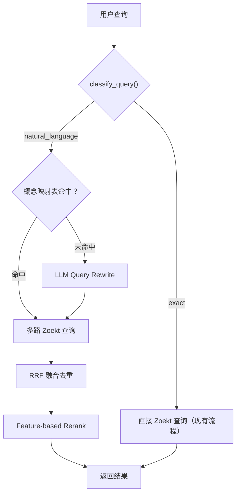

# P3：自然语言增强 — 部署方案

- 日期：2026-03-19
- 前置依赖：P0 Query API（`query_api/`）已部署并可用
- 参考文档：[自然语言增强实施.md](file:///home/jenkins/code/t2/docs/自然语言增强实施.md)

---

## 架构



在现有 `query_api/` 基础上新增 `nl/` 子模块，**不修改 Dify `/retrieval` 接口契约**。

---

## 文件结构

```
query_api/
├── app.py                    # [MODIFY] 集成 NL 分流逻辑
├── config.py                 # [MODIFY] 新增 NL 配置项
├── zoekt_client.py           # 不变
├── nl/                       # [NEW] 自然语言增强模块
│   ├── __init__.py
│   ├── classifier.py         # 查询意图分类（规则）
│   ├── rewriter.py           # LLM Query Rewrite + 超时降级
│   ├── merger.py             # RRF 多路融合
│   ├── reranker.py           # Feature-based 轻量 Rerank
│   ├── cache.py              # LRU 缓存 + 概念映射表
│   └── concept_map.json      # 高频 AOSP 概念→符号映射
└── requirements.txt          # [MODIFY] 新增 openai 依赖
```

---

## 部署步骤

### 步骤一：安装依赖

```bash
cd /home/jenkins/code/t2/query_api
pip install openai    # OpenAI 兼容 API 客户端（deepseek 也用这个）
```

### 步骤二：创建 NL 模块文件

```bash
mkdir -p nl
touch nl/__init__.py
```

需要创建以下文件（代码见下方 [完整代码](#完整代码)）：

| 文件 | 功能 | 行数 |
|------|------|------|
| `nl/classifier.py` | 规则分类器，区分精确/自然语言查询 | ~40 |
| `nl/rewriter.py` | LLM query rewrite + 超时降级 | ~80 |
| `nl/merger.py` | RRF 融合多路召回结果 | ~30 |
| `nl/reranker.py` | Feature-based 轻量重排 | ~50 |
| `nl/cache.py` | Rewrite 缓存 + 概念映射表 | ~50 |
| `nl/concept_map.json` | AOSP 高频概念→符号映射 | ~15 |

### 步骤三：配置环境变量

```bash
# 在 run.sh 或 systemd service 中添加：
export NL_ENABLED=true                              # 开关
export NL_MODEL=deepseek-chat                       # LLM 模型
export NL_API_KEY="sk-your-llm-key"                 # LLM API Key
export NL_API_BASE="https://api.deepseek.com/v1"    # LLM API 地址
export NL_TIMEOUT=2.0                               # LLM 超时（秒）
```

### 步骤四：修改 app.py 集成 NL 分流

在 `/retrieval` 端点的搜索逻辑前插入分流：

```python
import asyncio
import config

# 在 retrieval() 函数中，搜索 Zoekt 之前：
if config.NL_ENABLED:
    from nl.classifier import classify_query
    query_type = classify_query(body.query)
    logger.info("Query classified as: %s", query_type)
else:
    query_type = "exact"

if query_type == "natural_language":
    from nl.rewriter import rewrite_query
    from nl.merger import rrf_merge
    from nl.reranker import feature_rerank

    # 1. LLM Rewrite
    rewrite_results = await rewrite_query(body.query)
    logger.info("Rewrite generated %d queries", len(rewrite_results))

    # 2. 多路并行 Zoekt 查询
    tasks = [
        zoekt_client.search(
            query=rq["query"], top_k=20,
            score_threshold=0, repos=repos_filter,
        )
        for rq in rewrite_results
    ]
    all_results = await asyncio.gather(*tasks)

    # 3. RRF 融合
    merged = rrf_merge(all_results)

    # 4. Feature-based rerank
    records = feature_rerank(body.query, merged, top_n=body.retrieval_setting.top_k)
else:
    # 原有精确查询路径
    records = await zoekt_client.search(...)
```

### 步骤五：启动与测试

```bash
# 启动
sudo NL_ENABLED=true NL_API_KEY="sk-xxx" API_KEY="your-key" ./run.sh

# 测试精确查询（应走 exact 路径，日志显示 "Query classified as: exact"）
curl -X POST http://localhost:445/retrieval \
  -H "Content-Type: application/json" \
  -H "Authorization: Bearer your-key" \
  -d '{"knowledge_id":"default","query":"SystemServer","retrieval_setting":{"top_k":5,"score_threshold":0}}'

# 测试自然语言查询（应走 NL 路径）
curl -X POST http://localhost:445/retrieval \
  -H "Content-Type: application/json" \
  -H "Authorization: Bearer your-key" \
  -d '{"knowledge_id":"default","query":"SystemServer 的启动流程是什么","retrieval_setting":{"top_k":5,"score_threshold":0}}'
```

### 步骤六：关闭/灰度

```bash
# 关闭 NL 增强（所有查询走 exact）
export NL_ENABLED=false

# 只对特定场景开启：在 app.py 中按 knowledge_id 判断
```

---

## 延迟预算

| 阶段 | exact 查询 | NL 查询（缓存未命中） | NL 查询（缓存命中） |
|------|-----------|---------------------|-------------------|
| 分类 | ~1ms | ~1ms | ~1ms |
| LLM Rewrite | - | 200-400ms | ~1ms |
| 多路 Zoekt | - | 50-100ms | 50-100ms |
| RRF 融合 | - | ~5ms | ~5ms |
| Feature Rerank | - | ~3ms | ~3ms |
| **总计** | **20-50ms** | **300-550ms** | **60-110ms** |

---

## 后续升级路径

| 阶段 | 内容 | 触发条件 |
|------|------|----------|
| **V1**（本方案） | 规则分类 + LLM Rewrite + RRF + Feature Rerank | 立即实施 |
| **V1.5** | 扩展 `concept_map.json` 到 50-100 条 | 积累用户查询日志后 |
| **V2** | 部署 `bge-reranker-v2-m3` 替代 feature rerank | feature rerank 效果不足时 |
| **V3** | 添加代码摘要生成（仅 Dify RAG 场景） | 需要提升 LLM 回答质量时 |

---

## 完整代码

> 以下为各模块的完整实现代码，供直接复制使用。

### nl/classifier.py

```python
"""查询意图分类器"""
import re


def classify_query(query: str) -> str:
    """返回 'exact' 或 'natural_language'"""
    q = query.strip()

    # Zoekt 修饰符 → exact
    if re.match(r'^(sym:|file:|r:|lang:|case:)', q):
        return 'exact'
    if re.match(r'^r".*"$', q):
        return 'exact'

    # NL 指示词 → 优先 NL（即使含 CamelCase）
    nl_words = [
        '怎么', '什么', '如何', '为什么', '哪里', '流程', '机制', '原理',
        '启动', '调用', '实现', '过程', '步骤', '作用', '区别', '解释',
        'how', 'what', 'why', 'where', 'explain', 'describe', 'find',
    ]
    if any(w in q.lower() for w in nl_words):
        return 'natural_language'

    # 纯符号/路径 → exact
    if re.match(r'^[A-Za-z0-9_./:\-]+$', q):
        return 'exact'

    # 较长句子 → NL
    if len(q) > 15 and ' ' in q:
        return 'natural_language'

    return 'exact'
```

### nl/rewriter.py

```python
"""LLM Query Rewrite"""
import json, logging
import httpx
from config import NL_MODEL, NL_API_KEY, NL_API_BASE, NL_TIMEOUT
from nl.cache import get_cached_rewrite, set_cached_rewrite

logger = logging.getLogger(__name__)

PROMPT = """你是 AOSP 代码搜索助手。把用户问题转换成 3-5 个代码搜索查询。
规则：使用类名、函数名、文件路径。不确定时用关键词组合。
严格输出 JSON：{"queries":[{"query":"...","rationale":"..."}]}

用户问题：{q}"""


async def rewrite_query(query: str) -> list[dict]:
    cached = get_cached_rewrite(query)
    if cached:
        logger.info("Rewrite cache hit")
        return cached

    try:
        async with httpx.AsyncClient(timeout=NL_TIMEOUT) as client:
            resp = await client.post(
                f"{NL_API_BASE}/chat/completions",
                headers={"Authorization": f"Bearer {NL_API_KEY}",
                         "Content-Type": "application/json"},
                json={
                    "model": NL_MODEL,
                    "messages": [{"role": "user", "content": PROMPT.replace("{q}", query)}],
                    "temperature": 0.2,
                },
            )
            resp.raise_for_status()
            text = resp.json()["choices"][0]["message"]["content"]
            # 提取 JSON（兼容 markdown code block 包裹）
            if "```" in text:
                text = text.split("```")[1]
                if text.startswith("json"):
                    text = text[4:]
            result = json.loads(text)
            queries = result.get("queries", [])
            if queries:
                set_cached_rewrite(query, queries)
            return queries
    except Exception as e:
        logger.warning("Rewrite failed, fallback: %s", e)
        return _fallback(query)


def _fallback(query: str) -> list[dict]:
    """超时降级：提取可能的代码关键词"""
    import re
    symbols = re.findall(r'[A-Z][a-zA-Z]{2,}', query)
    words = re.findall(r'[a-zA-Z]{3,}', query)
    kws = list(dict.fromkeys(symbols + words))[:4] or [query]
    return [{"query": kw, "rationale": "fallback"} for kw in kws]
```

### nl/merger.py

```python
"""RRF 多路融合"""
from collections import defaultdict


def rrf_merge(result_lists: list[list[dict]], k: int = 60) -> list[dict]:
    scores = defaultdict(float)
    docs = {}

    for results in result_lists:
        for rank, doc in enumerate(results):
            meta = doc.get("metadata", {})
            doc_id = (meta.get("repo", ""), meta.get("path", ""), doc.get("title", ""))
            scores[doc_id] += 1.0 / (k + rank + 1)
            docs[doc_id] = doc

    sorted_ids = sorted(scores, key=scores.get, reverse=True)
    out = []
    for did in sorted_ids:
        d = docs[did]
        d["score"] = round(scores[did], 4)
        out.append(d)
    return out
```

### nl/reranker.py

```python
"""Feature-based 轻量 Rerank"""


def feature_rerank(query: str, candidates: list[dict], top_n: int = 10) -> list[dict]:
    """基于特征的轻量重排"""
    query_lower = query.lower()
    query_tokens = set(query_lower.split())

    scored = []
    for c in candidates:
        score = c.get("score", 0)
        title = c.get("title", "").lower()
        content = c.get("content", "").lower()

        # 特征 1：标题中包含查询关键词
        title_hits = sum(1 for t in query_tokens if t in title)
        score += title_hits * 0.1

        # 特征 2：内容中关键词命中密度
        content_hits = sum(1 for t in query_tokens if t in content)
        score += min(content_hits * 0.02, 0.1)

        # 特征 3：文件扩展名优先级（.java > .cpp > 其他）
        if title.endswith('.java'):
            score += 0.05
        elif title.endswith(('.cpp', '.cc', '.h')):
            score += 0.03

        scored.append((score, c))

    scored.sort(key=lambda x: x[0], reverse=True)
    result = []
    for s, c in scored[:top_n]:
        c["score"] = round(s, 4)
        result.append(c)
    return result
```

### nl/cache.py

```python
"""Rewrite 缓存 + 概念映射表"""
import hashlib, time, json, os, logging

logger = logging.getLogger(__name__)

NL_CACHE_TTL = int(os.getenv("NL_CACHE_TTL", "86400"))
_cache: dict[str, tuple[float, list]] = {}

# 加载概念映射表
_concept_map: dict[str, list[dict]] = {}
_MAP_PATH = os.path.join(os.path.dirname(__file__), "concept_map.json")
if os.path.exists(_MAP_PATH):
    with open(_MAP_PATH, "r") as f:
        raw = json.load(f)
    _concept_map = {
        k: [{"query": sym, "rationale": "concept_map"} for sym in v]
        for k, v in raw.items()
    }
    logger.info("Loaded %d concept map entries", len(_concept_map))


def get_cached_rewrite(query: str) -> list[dict] | None:
    for concept, queries in _concept_map.items():
        if concept in query:
            return queries
    key = hashlib.md5(query.strip().lower().encode()).hexdigest()
    if key in _cache:
        ts, result = _cache[key]
        if time.time() - ts < NL_CACHE_TTL:
            return result
        del _cache[key]
    return None


def set_cached_rewrite(query: str, result: list[dict]):
    key = hashlib.md5(query.strip().lower().encode()).hexdigest()
    _cache[key] = (time.time(), result)
```

### nl/concept_map.json

```json
{
  "SystemServer 启动": ["SystemServer", "startBootstrapServices", "startCoreServices", "file:SystemServer.java"],
  "Activity 生命周期": ["ActivityThread", "handleLaunchActivity", "performCreate", "performResume"],
  "Binder 通信": ["BinderProxy", "transact", "onTransact", "IPCThreadState"],
  "权限检查": ["checkPermission", "enforcePermission", "PermissionManagerService"],
  "窗口管理": ["WindowManagerService", "WindowState", "DisplayContent"],
  "Zygote": ["ZygoteInit", "forkSystemServer", "ZygoteServer"],
  "AMS": ["ActivityManagerService", "startActivity", "ActivityStarter"],
  "PMS": ["PackageManagerService", "scanDirLI", "PackageParser"],
  "Input 事件": ["InputDispatcher", "InputReader", "InputChannel"],
  "开机流程": ["SystemServer", "ZygoteInit", "init.rc"]
}
```
