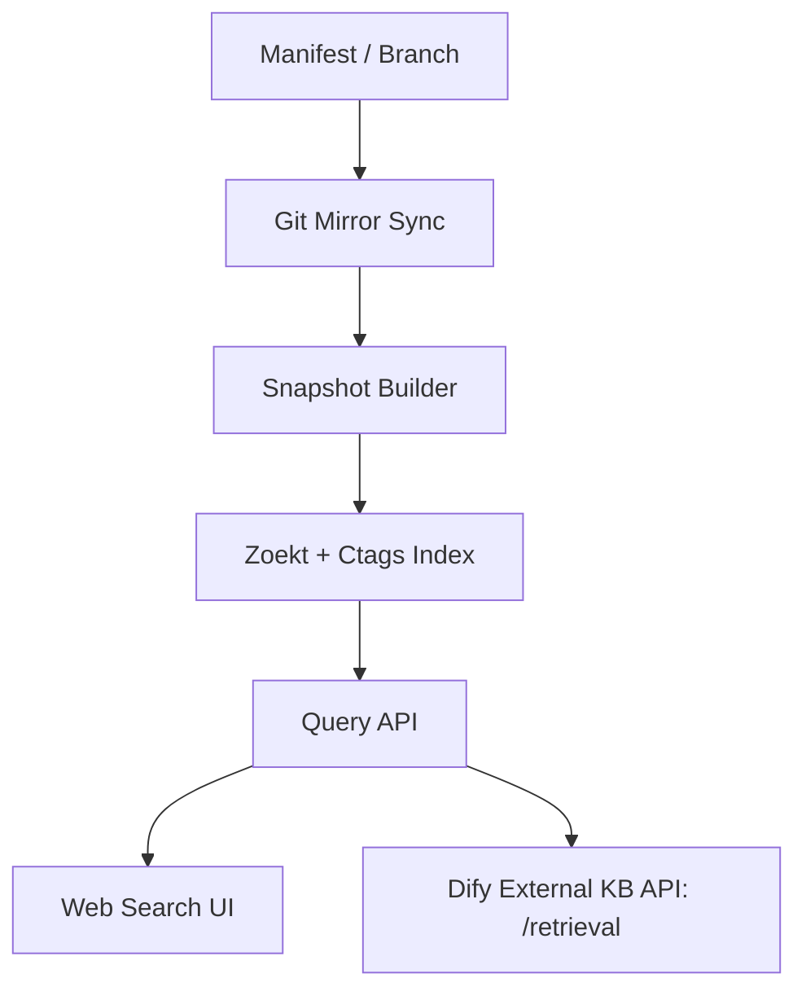

# AOSP 代码检索系统部署指南

> 基于 [方案.md](file:///home/jenkins/code/t2/docs/方案.md) 中的推荐落地架构，以 P0（最小可用版）为目标。

---

## 架构总览



目标：打通 **mirror → snapshot → Zoekt 索引 → Web UI → Dify `/retrieval`** 全链路。

---

## 前置条件

| 项目 | 要求 |
|------|------|
| 操作系统 | Linux（推荐 Ubuntu 22.04+） |
| 磁盘 | ≥ 200 GB（AOSP 源码 40 GB + Zoekt 索引预估 100 GB+） |
| 内存 | ≥ 32 GB（Zoekt 索引构建和运行时均需大量内存） |
| 工具链 | `git`、`repo`、`Go 1.21+`、`Universal Ctags`、`Python 3.10+`（或 Node/Go 用于 Query API） |
| Dify 实例 | 已部署的 Dify 实例，用于接入外部知识库 |

---

## 步骤一：准备 AOSP Git Mirror

### 1.1 初始化 repo mirror

```bash
mkdir -p /data/aosp-mirror
cd /data/aosp-mirror
repo init -u https://android.googlesource.com/platform/manifest \
  -b android-latest-release \
  --mirror
repo sync -j8 --no-clone-bundle
```

> P0 阶段只同步一个 release 分支，例如 `android-latest-release`。

### 1.2 设置定时同步（可选）

```bash
# crontab 示例：每天凌晨 2 点增量同步
0 2 * * * cd /data/aosp-mirror && repo sync -j4 --no-clone-bundle >> /var/log/aosp-sync.log 2>&1
```

---

## 步骤二：构建 Snapshot（检出工作目录）

### 2.1 从 mirror 检出指定 release

```bash
mkdir -p /data/aosp-snapshot/android-latest-release
cd /data/aosp-snapshot/android-latest-release
repo init -u /data/aosp-mirror/platform/manifest.git \
  -b android-latest-release \
  --reference=/data/aosp-mirror
repo sync -j8 --local-only
```

### 2.2 记录 manifest 元数据

```bash
repo manifest -r -o /data/aosp-snapshot/android-latest-release/snapshot-manifest.xml
```

> 此文件用于后续索引中关联 repo 名称和 manifest path。

---

## 步骤三：安装 Zoekt 和 Universal Ctags

### 3.1 安装 Universal Ctags

```bash
# Ubuntu
sudo apt-get install -y universal-ctags

# 验证
ctags --version   # 应显示 Universal Ctags
```

### 3.2 编译安装 Zoekt

```bash
# 确保已安装 Go 1.21+
go install github.com/sourcegraph/zoekt/cmd/zoekt-index@latest
go install github.com/sourcegraph/zoekt/cmd/zoekt-webserver@latest
go install github.com/sourcegraph/zoekt/cmd/zoekt-git-index@latest
```

验证：

```bash
zoekt-index --help
zoekt-webserver --help
```

---

## 步骤四：构建 Zoekt 索引

### 4.1 索引策略

> **关键设计点：** 索引中的 repo 名应使用 manifest path（如 `frameworks/base`），而非 Git 仓库名。这样搜索结果路径与开发者在 AOSP checkout 中看到的路径一致。

### 4.2 编写索引脚本

创建 `index_aosp.sh`：

```bash
#!/bin/bash
set -euo pipefail

SNAPSHOT_DIR="/data/aosp-snapshot/android-latest-release"
INDEX_DIR="/data/zoekt-index"
BRANCH="android-latest-release"

mkdir -p "$INDEX_DIR"

# 遍历 snapshot 中的每个 git 仓库
find "$SNAPSHOT_DIR" -name ".git" -type d | while read gitdir; do
    repo_dir=$(dirname "$gitdir")
    # 用 manifest path 作为 repo name
    repo_name=$(realpath --relative-to="$SNAPSHOT_DIR" "$repo_dir")

    echo "Indexing: $repo_name"
    zoekt-git-index \
        -index "$INDEX_DIR" \
        -branches "$BRANCH" \
        -prefix "aosp:" \
        -name "$repo_name" \
        "$repo_dir"
done

echo "Index complete. Output: $INDEX_DIR"
```

### 4.3 执行索引构建

```bash
chmod +x index_aosp.sh
./index_aosp.sh
```

> ⚠️ 全量 AOSP 索引构建预计耗时 **数小时**，请确保磁盘和内存充足。

---

## 步骤五：启动 Zoekt Web 服务

```bash
zoekt-webserver \
    -index /data/zoekt-index \
    -listen :6070 \
    -rpc
```

验证：

```bash
# Web UI
curl http://localhost:6070

# 搜索测试
curl "http://localhost:6070/search?q=SystemServer&num=10"
```

### 5.1 使用 systemd 管理（推荐）

创建 `/etc/systemd/system/zoekt-webserver.service`：

```ini
[Unit]
Description=Zoekt Web Server
After=network.target

[Service]
Type=simple
User=zoekt
ExecStart=/usr/local/bin/zoekt-webserver -index /data/zoekt-index -listen :6070 -rpc
Restart=always
RestartSec=5
LimitNOFILE=65536

[Install]
WantedBy=multi-user.target
```

```bash
sudo systemctl daemon-reload
sudo systemctl enable --now zoekt-webserver
```

---

## 步骤六：构建 Query API（Dify 适配层）

Query API 是 Zoekt 与 Dify 之间的桥梁，监听 **445 端口**，供外部 Dify 实例调用。

完整实现位于 `query_api/` 目录，包含以下文件：

| 文件 | 说明 |
|------|------|
| `config.py` | 配置管理（Zoekt 地址、API Key、端口、上下文窗口） |
| `zoekt_client.py` | Zoekt `/api/search` 客户端，结果转换为 Dify 格式 |
| `app.py` | FastAPI 主应用，实现 `POST /retrieval` 端点 |
| `requirements.txt` | Python 依赖（fastapi、uvicorn、httpx） |
| `run.sh` | 启动脚本 |
| `zoekt-query-api.service` | systemd 服务配置 |

### 6.1 安装依赖

```bash
cd query_api
pip3 install -r requirements.txt
```

### 6.2 配置

通过环境变量配置（或修改 `config.py` 默认值）：

| 变量名 | 默认值 | 说明 |
|--------|--------|------|
| `ZOEKT_URL` | `http://localhost:6070` | Zoekt webserver 地址 |
| `API_KEY` | `your-api-key` | Dify 连接时使用的鉴权密钥 |
| `PORT` | `445` | 服务监听端口 |
| `DEFAULT_CONTEXT_LINES` | `20` | 命中行上下文窗口行数 |

> ⚠️ 端口 445 < 1024，需要 root 权限启动，或对 python3 设置 `cap_net_bind_service`：
> ```bash
> sudo setcap 'cap_net_bind_service=+ep' $(which python3)
> ```

### 6.3 启动服务

**方式一：直接启动**

```bash
sudo PORT=445 API_KEY="your-secret-key" ./run.sh
```

**方式二：systemd 管理（推荐）**

```bash
# 修改 zoekt-query-api.service 中的 API_KEY 等环境变量
sudo cp zoekt-query-api.service /etc/systemd/system/
sudo systemctl daemon-reload
sudo systemctl enable --now zoekt-query-api
```

### 6.4 API 契约

端点严格遵循 [Dify 外部知识库 API 规范](https://docs.dify.ai/zh/use-dify/knowledge/external-knowledge-api)：

```text
POST http://<your-server>:445/retrieval
Authorization: Bearer {API_KEY}
Content-Type: application/json
```

**请求体：**

```json
{
  "knowledge_id": "aosp:android-latest-release",
  "query": "SystemServer startBootstrapServices",
  "retrieval_setting": {
    "top_k": 5,
    "score_threshold": 0.5
  }
}
```

**响应体：**

```json
{
  "records": [
    {
      "title": "base/services/java/.../SystemServer.java",
      "content": "// Line 120\nprivate void startBootstrapServices() {\n    ...\n}",
      "score": 0.91,
      "metadata": {
        "repo": "base",
        "path": "services/java/com/android/server/SystemServer.java",
        "start_line": 100,
        "end_line": 140
      }
    }
  ]
}
```

**`knowledge_id` 使用方式：**
- `default` — 搜索所有已索引仓库
- `aosp:frameworks/base` — 仅搜索 repo 名包含 `frameworks/base` 的仓库

### 6.5 验证

```bash
curl -X POST http://localhost:445/retrieval \
  -H "Content-Type: application/json" \
  -H "Authorization: Bearer your-secret-key" \
  -d '{
    "knowledge_id": "default",
    "query": "SystemServer",
    "retrieval_setting": { "top_k": 3, "score_threshold": 0.5 }
  }'
```

健康检查：

```bash
curl http://localhost:445/health
# 返回 {"status": "ok"}
```

---

## 步骤七：接入 Dify 外部知识库

### 7.1 在 Dify 中关联外部知识库 API

1. 进入 **Dify 管理后台 → 知识库**
2. 点击右上角 **"外部知识库 API"**，点击 **"添加外部知识库 API"**
3. 填写：
   - **名称**: `AOSP 代码搜索`（自定义）
   - **API 接口地址**: `http://<your-server>:445/retrieval`
   - **API Key**: 与 Query API 中配置的 `API_KEY` 一致

### 7.2 连接外部知识库

1. 回到 **知识库** 页面，点击 **"连接外部知识库"**
2. 填写：
   - **知识库名称**: `AOSP 代码库`
   - **外部知识库 API**: 选择上一步添加的 API
   - **外部知识库 ID**: `default`（或 `aosp:frameworks/base` 等限定搜索范围）
   - **Top K**: `5`
   - **Score 阈值**: `0.5`

### 7.3 在 Dify 应用中使用

1. 新建或编辑一个 **Dify 应用**（Chatbot / Agent / Chatflow）
2. 在 **上下文** 中选择带 `EXTERNAL` 标签的外部知识库
3. 测试提问，例如：*"SystemServer 的启动流程是什么？"*

---

## 步骤八：验证与测试

### 8.1 端到端验证清单

| # | 检查项 | 预期结果 |
|---|--------|----------|
| 1 | Zoekt Web UI 能正常打开 | `http://localhost:6070` 返回搜索页面 |
| 2 | Zoekt 搜索返回结果 | 搜索 `SystemServer` 能召回 `frameworks/base` 下的相关文件 |
| 3 | 搜索结果 repo 名是 manifest path | 结果显示 `frameworks/base`，而非 Git 仓库原始名 |
| 4 | Query API `/retrieval` 响应正确 | 返回符合 Dify 契约的 JSON |
| 5 | Dify 应用能成功调用外部知识库 | 在 Dify 应用中提问，能看到代码片段作为上下文 |

### 8.2 常见问题排查

| 问题 | 可能原因 | 解决方案 |
|------|----------|----------|
| 索引构建 OOM | 内存不足 | 增大内存或分批索引 |
| 搜索无结果 | 索引未包含目标分支 | 检查 `zoekt-git-index` 的 `-branches` 参数 |
| Dify 报连接失败 | API 未启动或端口不通 | 检查 Query API 进程和防火墙 |
| 结果路径不符合预期 | repo 命名不对 | 确认 `-name` 参数使用 manifest path |

---

## 后续演进（P1 - P3）

| 阶段 | 主要内容 |
|------|----------|
| **P1** | 支持多 branch / 多 release、增量更新、Postgres 元数据存储、权限/缓存/监控 |
| **P2** | 对热点模块（`frameworks/base`、`system/core` 等）补 SCIP 精确导航 |
| **P3** | 自然语言 query rewrite、轻量 rerank、代码片段摘要 |

---

## 参考资料

- [Dify 连接外部知识库](https://docs.dify.ai/zh/use-dify/knowledge/connect-external-knowledge-base)
- [Dify 外部知识库 API](https://docs.dify.ai/zh/use-dify/knowledge/external-knowledge-api)
- [Zoekt GitHub](https://github.com/sourcegraph/zoekt)
- [Universal Ctags](https://ctags.io/)
- [方案.md](file:///home/jenkins/code/t2/docs/方案.md)（完整方案文档）
